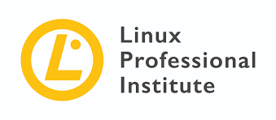

# 🐧 Hi there 👋 🇧🇷, Welcome to my GitHub profile!

<!--
**emanuelhaine/emanuelhaine** is a ✨ _special_ ✨ repository because its `README.md` (this file) appears on your GitHub profile.

Here are some ideas to get you started:

- 🔭 I’m currently working on ...
- 🌱 I’m currently learning ...
- 👯 I’m looking to collaborate on ...
- 🤔 I’m looking for help with ...
- 💬 Ask me about ...
- 📫 How to reach me: ...
- 😄 Pronouns: ...
- ⚡ Fun fact: ...
-->
## LinkedIn Profile

## Interests
- C Language 👨🏻‍💻
- Python 🐍
- Bash 🐚
- Ansible 🤖
- Linux/Unix 🐧
- Computer Networking 🧑🏻‍💻

## Colaboration 
- I’m looking to collaborate on Linux/Unix projects

## Certifications and Badges
<!--
<table border="0" style="border: none;">
  <tr>
    <td>
      
    </td>
    <td>
      
    </td>
</table>  
-->
- [Credly badges](https://www.credly.com/users/emanuel-baptista-haine/badges) 
- [LPI certifications](https://cs.lpi.org/caf/Xamman/certification/verify/LPI000447269/ehrntspkhy)
- [Red Hat certifications](https://rhtapps.redhat.com/verify?certId=220-030-795)

> "Whenever there are alternatives, be careful. Do not choose the convenient, the comfortable, the respectable, the socially acceptable, the honorable.
> Choose what makes your heart vibrate. Choose what you would like to do, despite all the consequences." Osho
